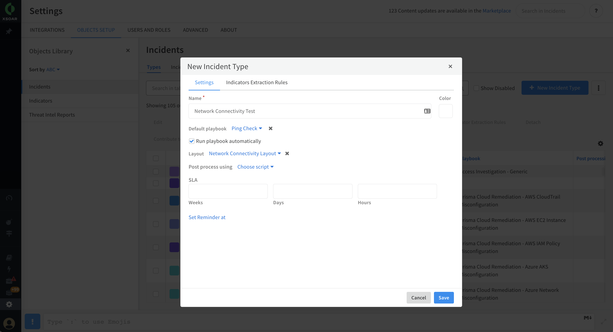

# Cortex XSOAR for Network Automation

## Overview
The Cortex XSOAR platform is a robust automation tool with a wide variety of applications.
XSOAR can run commands and automations which interact with a large array of tools found in an organization.
Under the hood XSOAR is powered by Python scripts and Docker containers so it is very flexible!

By providing a simple drag and drop interface automations and data collection tasks can be orchestrated to create playbooks which execute workflows for each particular use case in your organization.
These workflows can be triggered by fetching cases from external ticketing systems or manually from within the XSOAR platform.

The use cases in this workshop will focus on troubleshooting network devices by running various commands from XSOAR such as ping and telnet.  SSH will also be used to login to remote devices and run additional commands on the device itself.  An incident type for each use case will be created as well as custom fields and layouts to present the data to an end user.  Incidents will be created manually in the XSOAR incident to then trigger the appropriate workflows.

## Concepts

### Marketplace and Integrations
 * https://docs.paloaltonetworks.com/cortex/cortex-xsoar/6-6/cortex-xsoar-admin/marketplace
 * https://xsoar.pan.dev/marketplace
### Running Commands
 * https://docs.paloaltonetworks.com/cortex/cortex-xsoar/6-6/cortex-xsoar-admin/cortex-xsoar-overview/use-the-command-line-interface
### Context
 * https://docs.paloaltonetworks.com/cortex/cortex-xsoar/6-6/cortex-xsoar-admin/incidents/incident-management/incident-context-data
### Building Playbooks
 * https://docs.paloaltonetworks.com/cortex/cortex-xsoar/6-6/cortex-xsoar-admin/playbooks
### Creating a Use case
  * https://docs.paloaltonetworks.com/cortex/cortex-xsoar/6-6/cortex-xsoar-admin/incidents/incident-lifecycle
  * https://docs.paloaltonetworks.com/cortex/cortex-xsoar/6-6/cortex-xsoar-admin/incidents/customize-incident-view-layouts/create-an-incident-type
  * https://docs.paloaltonetworks.com/cortex/cortex-xsoar/5-5/cortex-xsoar-admin/incidents/incidents-management/customize-incident-view-layouts/customize-an-incident-type-layout


## Use Case 1 - Host Alive
Topcis Covered: Playbooks, Conditional tasks, Context, Incident Types, Incident Fields

When there are networking issues with a device it is common practice to run troubleshooting commands which check if the host is responsive to ICMP requests and the required ports on the device are open.
XSOAR has builtin automations called !Ping and !PortListenCheck to assist in determining connectivity to devices on your network.


### Executing Commands and Context
First let's become familiar with executing commands within XSOAR.
Login to the platform and type `!` into the CLI at the bottom of the application window.
This will prompt and show you the commands which are available in the platform.


Additional functionality can be enabled by installing and configuring additional integrations.
These integrations are found in the XSOAR marketplace and are covered in more depth in the next use case.


Each user has their own playground where ad hoc commands can be run for testing purposes.
You can run the !Ping command to send ICMP packets to a specific host.
Try and run the command against a specific target and check the output received into the XSOAR warroom.
Try the command against both reachable and unreachable hosts.
Note how the output differs.


Note that in addition to the output printed into the warroom, data is also stored in "context".
Context is the way data is passed between various automations and conditional tasks when building playbooks.
You can click on a context key to copy its path for use in subsequent commands.
For example click on the `ret_code` key to save the path to your clipboard.

You can then use it as a variable in another command such as 

```
!Print value=${Ping.ret_code}
```

Congratulations you have successfully executed your first commands in Cortex XSOAR and can access the context data!

Note you can clear the context and start again by running `!DeleteContext`.

Since no values are returned to context if a host is not reachable we will use this behavior when building the playbook logic.


### Playbook Editor

Open the Playbook editor in the left hand menu to begin orchestrating automations and tasks into a workflow.

The high level flow for this first playbook will be to check if the host responds to ping requests.

Here is a high level use case flow diagram

[insert flow diagram]

Create a new playbook in the XSOAR playbook tab and the playbook editor and debugger will automatically be opened.
You can start adding tasks by dragging and dropping them, or selecting a new task from the task library.

These tasks can be automations, manual tasks, data collection tasks and conditionals.
The `!Ping` automation we previously ran in the warroom can be added as the first step in the playbook.
Note the inputs are exactly the same as the ones provided during CLI execution.


For now hard code an IP into the `target` argument and save the playbook.
Note that in the case of an unreachable host an error is thrown. The "Stop on errors" check box at the bottom of the automation window should be set to "No" for this task.
You can then click run to see the playbook execute.
By opening the debugger panel on the right hand side you can see the data stored in the context.


Again copy the location of the `ret_code` as we will use it in the following conditional task.
You can now stop the playbook execution.


Add another step in the playbook and select the conditional task type.

Since the context is not populated when the host is not reachable we will simply check for the `ret_code`.


Create two new tasks off of the previous conditional.
Note you can now select which conditional branch the task applies too, one for the "yes" condition previously defined and an "else" branch.

If the "yes" condition is met run the `closeInvestigation` automation.
If "else" condition create a manual task for review.


Now it may be useful to have a variable input to this playbook where the IP can be passed.
Select the "Playbook Triggered" step which is the first of the playbook.
Add an input called "Host". Update the first step of the playbook to use this input instead of the hardcoded value.


Run the playbook a couple times using different values to confirm it is working as expected.


### Incident Type and Layout

Whether an external ticket is ingested into the platform or an incident is manually created within XSOAR the assignment of an incident type can be used to determine the playbook that is run and the layout that is used.

Create a new incident type and layout can be created in XSOAR under Settings >> Objects Setup >> Incidents.
First let's create a new incident layout.
Add the out of the box field called `Host Name` onto the layout.
This will map to the input supplied to the playbook upon incident creation.


Let's also modify the new incident creation layout.
This will help simplify the inputs that are needed from an end user.


Layouts help analysts quickly view the information that is most relevant to them and then have the ability to take action.
Feel free to modify the layout in additional ways and view the documentation for what's possible.
 
Save and exit and layout editor and let's create a new incident type which will be used to assign the playbook and layout to new incidents.



The last step before creating a new incident is to map the supplied input to the playbook.
Back in the playbook editor select the "Playbook Triggered" step.


Update the input for the `Host` input to be `${incident.hostname}`.
Now the user supplied input will be used within the playbook.


### Trigger XSOAR Investigation
Everything is now ready to go for testing!
Go to the incidents tab on the left hand menu, and select "New Incident".
Start by selecting the new incident type previously created.
The layout will update and you will see the host name field.

Enter in the IP/hostname to check, provide an incident name and create the incident.


The playbook will now execute against the provided hostname!
Look around the investigation to get a better understanding of what is available.
Try different inputs to trigger the different conditional branches.

**Bonus**: Add the `!PortListenCheck` functionality as additional check in the playbook


## Use Case 2
Topics Covered: Integrations, Filters and Transformers, Data Collection Tasks

Use the Netmiko integration to ssh to a host and run a command


!PortListenCheck 
!URLSSLVerification


Netmiko to SSH to a host and then parse linux commands with XSOAR transformers. 


## Conclusion

